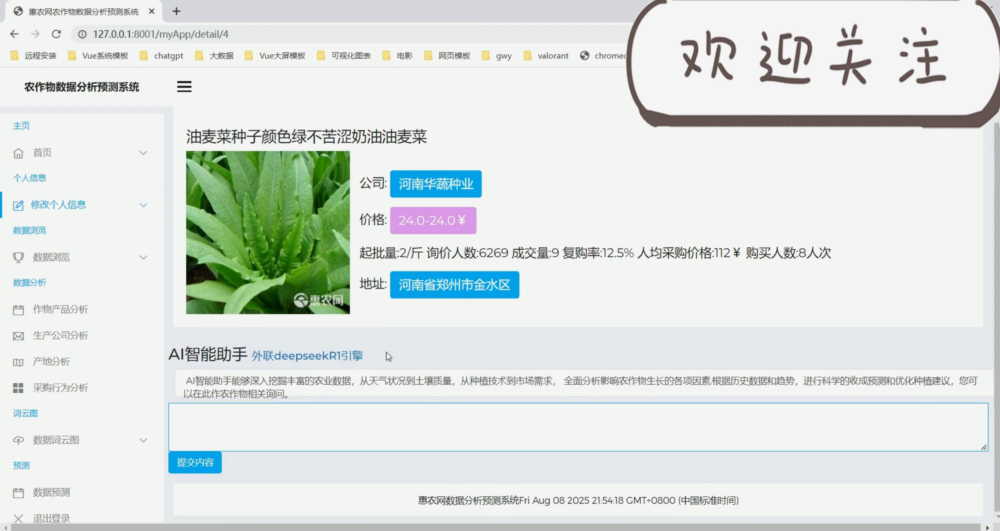
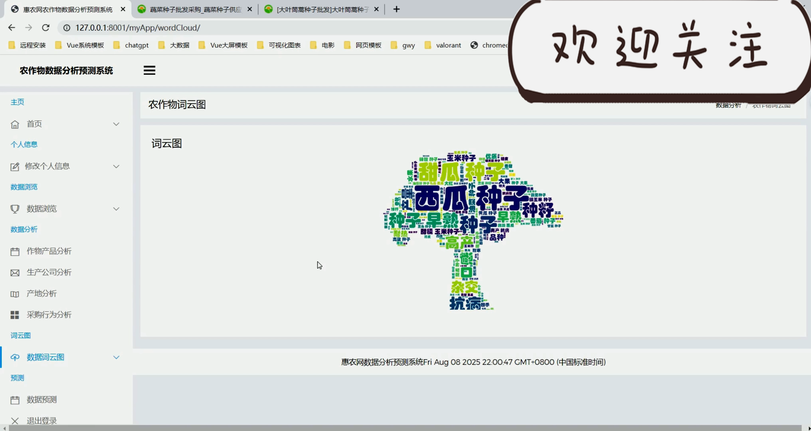
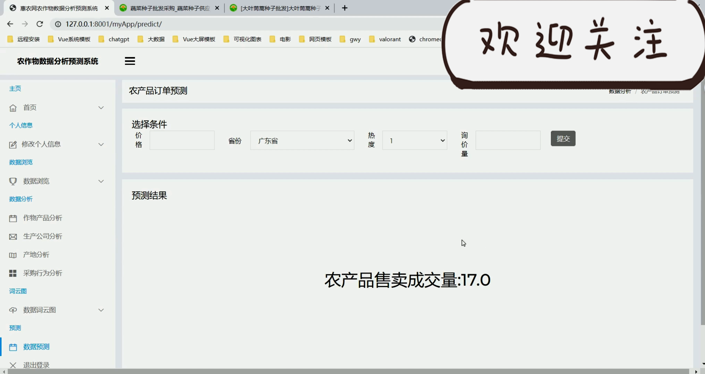

## 计算机毕业设计Spark+Hadoop+Hive+DeepSeek-R1农作物产量预测 农作物大模型AI问答 农作物数据分析可视化 大数据毕业设计(源码+文档+PPT+讲解)

## 要求
### 源码有偿！一套(论文 PPT 源码+sql脚本+教程)

### 
### 加好友前帮忙start一下，并备注github有偿26农产量预测
### 我的QQ号是1957722142 或者 2827724252或者798059319或者 1679232425
### 或者微信:biyesheji1698 或者 bysj2023nb


### 加qq好友说明（被部分 网友整得心力交瘁）：
    1.加好友务必按照格式备注
    2.避免浪费各自的时间！
    3.当“客服”不容易，repo 主是体面人，不爆粗，性格好，文明人。
## 介绍

```
需要定制项目+付费源码查看主页
技术栈：spark、hadoop、hive、mysql、requests、tensorflow预测算法
觉得视频对你有帮助的同学记得点赞关注三连哦~
（后续会继续为大家更新不同的教学视频，可以继续关注）
```


## 运行视频
https://www.bilibili.com/video/BV1tSagzrE5B

## 运行截图










